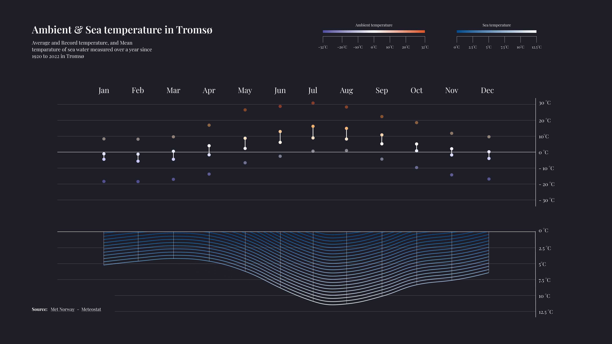
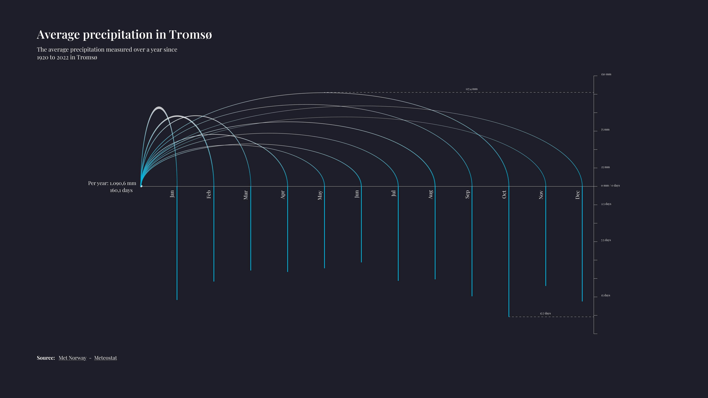
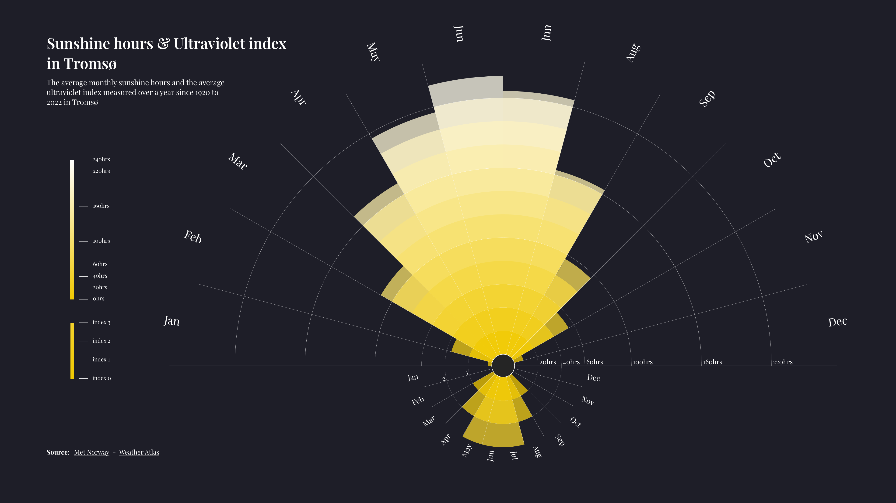
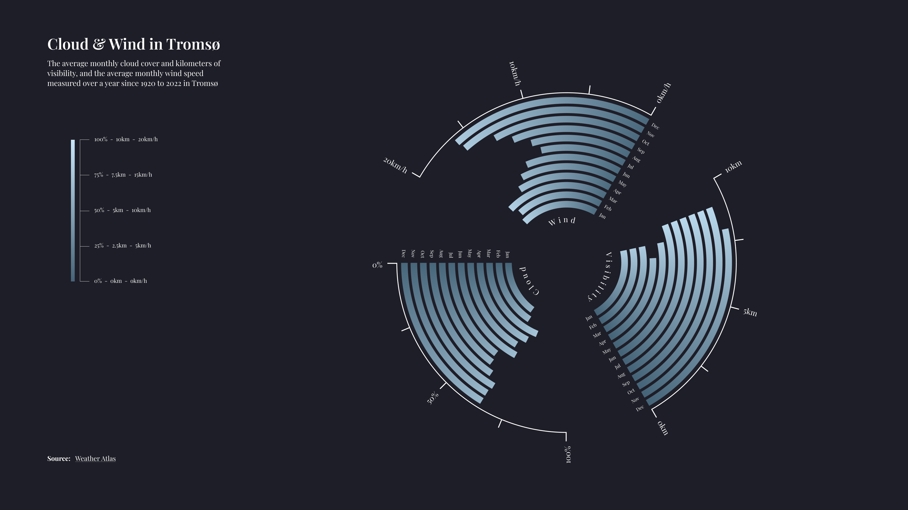
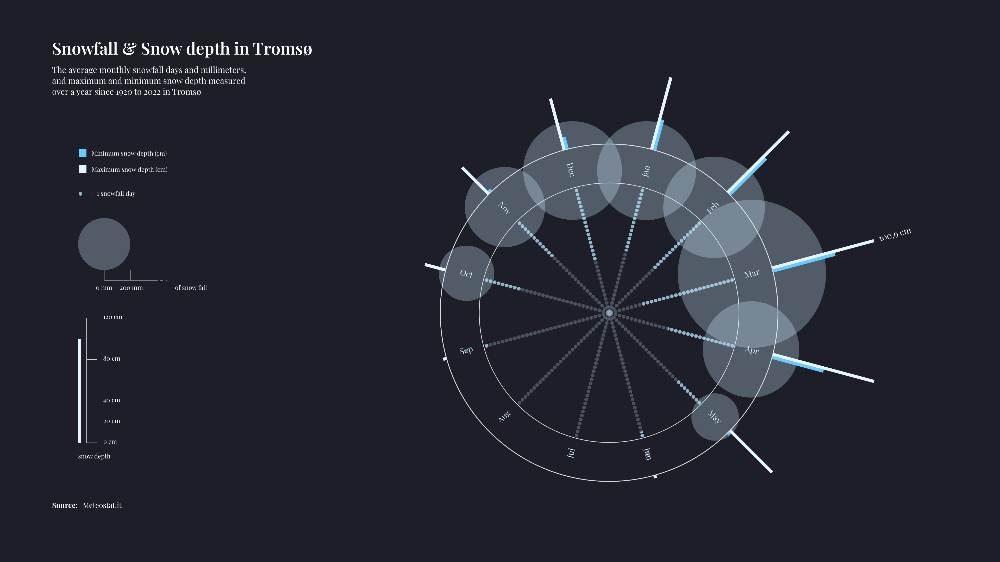

Tromsø is a city in the Arctic Circle where seasons are defined more by light than by temperature. This data visualization project explores a full year of weather in Tromsø through a set of vector-based visualizations that are both scientifically accurate and visually expressive. Every visual element was designed to echo the natural phenomena it represents, making data not only readable, but experiential.

The work was completed in **one week** using only **Google Sheets** for data processing and **Figma** for design.



## Objective

This project began with a simple question: *What does a year of Arctic weather feel like when the sun disappears and reappears in extremes?*\

Rather than approaching the topic with charts and dashboards, the aim was to build a poetic visual system that could narrate the rhythm of an Arctic year. Each visualization acts as a micro-story within the larger climate cycle of Tromsø.

## Dataset

The dataset was sourced from the **Norwegian Meteorological Institute**, covering a full calendar year. It included:

- **Ambient & sea temperatures** (average and record);
- **Monthly precipitation** (mm + rainy days);
- **Sunshine hours** & **UV index**;
- **Wind speed**, **cloud cover**, and **visibility**;
- **Snowfall** & **snow depth**.

All graphics maintain **quantitative precision**: each curve, bar, and arc reflects the true values of the source data.

## Design language

Each visualization was designed to evoke the **physical qualities** of the data it presents. The metaphor behind the form was chosen to reflect the lived experience of that specific phenomenon:

### Ambient & Sea temperature

A double-layer chart shows both ambient air temperatures (as vertical bars) and average sea temperatures (as a wave-shaped area chart).  
The **waveform** of the sea temperature creates a natural, fluid shape that echoes the movement of the ocean and temperature inversion during colder months.

### Precipitation

This chart blends an **arc diagram** (representing monthly average precipitation in mm) with a **vertical bar chart** (days of rainfall per month).  
The result creates a set of **splash-like curves**, evoking droplets hitting a surface—metaphorically visualizing both quantity and frequency.

### Sunshine hours & UV index

A **polar area chart**, half-circle shaped, represents the sunshine hours (outer yellow segments) and average UV index (inner segments).  
This visual resembles the **rays of the sun**, expanding and contracting across the year, making the seasonality of daylight immediately readable.

### Cloud, wind & visibility

Three variables—cloud cover, wind speed, and visibility—are displayed as **curved radial bar charts**, forming a circular pattern.  
The segments are arranged to resemble a **wind rose**, offering a sense of motion and orientation.

### Snowfall & snow depth

This circular diagram combines three dimensions:

- **Blue lines** for minimum and maximum snow depth
- **Dotted rings** for number of snowfall days  
- **Shaded circles** for snowfall amount in mm  

The layered circular structure mimics the **radial buildup of snow** during Arctic winter months.

## Reflections

This project was completed in one week, but it became a deep exercise in **visual storytelling, metaphor design, and constraint-driven creativity**.  
By using only Figma and static data, the process forced intentional design decisions—each shape, scale, and layout emerged from an idea rather than a preset template.

The result is a visual narrative that transforms climate data into experience: a glimpse into what it means to live through an Arctic year of light, darkness, and cold.
